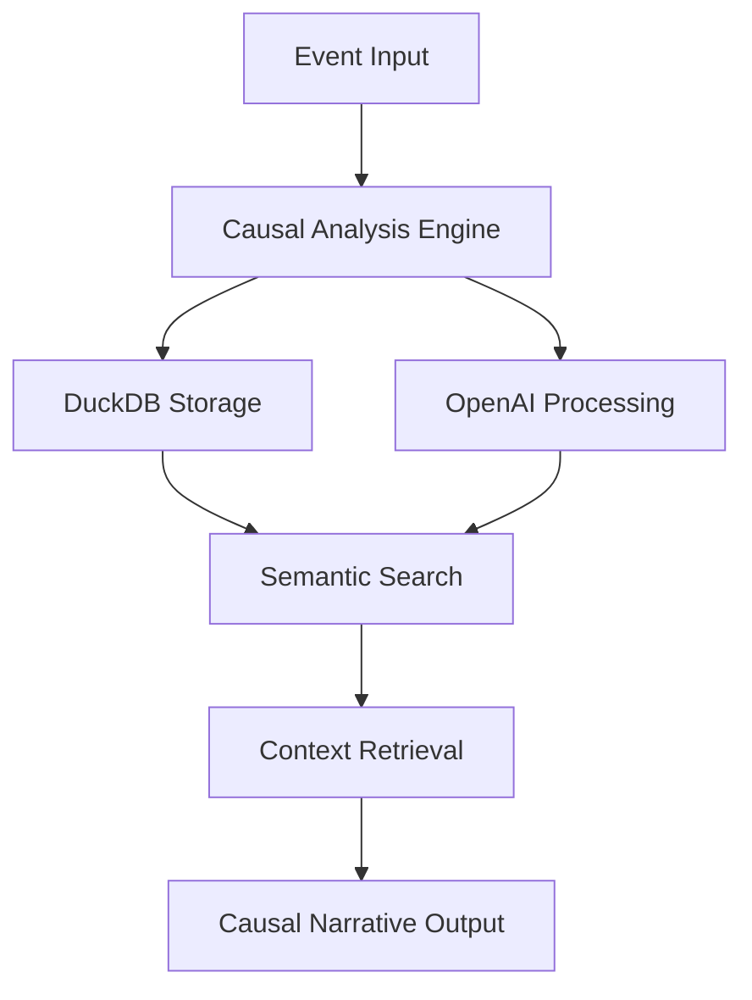

# 🧠 Causal Memory Core

<div align="center">


**Next-generation memory system for AI agents combining semantic recall and causal reasoning**

[](https://python.org)
[](LICENSE)
[](#testing)
[](https://modelcontextprotocol.io)

[🚀 Quick Start](#-quick-start) • [📖 Documentation](#-documentation) • [🧪 Testing](#-testing) • [🔧 Configuration](#-configuration)

</div>

---

## 🌟 Overview

Causal Memory Core transforms flat event lists into interconnected causal narratives, enabling AI agents to understand not just *what* happened, but *why* it happened and how events relate to each other.

### ✨ Key Features

- **🔗 Causal Reasoning**: Automatically detects and maps causal relationships between events
- **🧠 Semantic Memory**: Advanced semantic search and context retrieval
- **📊 DuckDB Backend**: High-performance, embedded database for fast queries
- **🤖 OpenAI Integration**: Leverages GPT models for intelligent event analysis
- **🔌 MCP Server Support**: Full Model Context Protocol compatibility
- **⚡ Real-time Processing**: Live event recording with immediate causal analysis

## 🚀 Quick Start

### Prerequisites

- Python 3.8 or higher
- OpenAI API key

### Installation

1. **Clone the repository**
   ```bash
   git clone https://github.com/sorrowscry86/Causal-Memory-Core.git
   cd Causal-Memory-Core
   ```

2. **Install dependencies**
   ```bash
   pip install -r requirements.txt
   ```

3. **Configure environment**
   ```bash
   cp .env.template .env
   # Edit .env and add your OPENAI_API_KEY
   ```

### Usage Examples

#### 🔥 Basic Usage
```python
from src.memory_core import CausalMemoryCore

# Initialize the memory system
memory = CausalMemoryCore()

# Record events
memory.add_event("User opened the application")
memory.add_event("User selected a document")
memory.add_event("Document loaded successfully")

# Query causal context
context = memory.get_context("document loading")
print(context)
```

#### 🖥️ CLI Interface
```bash
# Add events via CLI
python cli.py --add "Project meeting scheduled"
python cli.py --add "Team assigned to project"

# Query for context
python cli.py --query "project status"
```

#### 🔌 MCP Server Mode
```bash
# Start MCP server
python src/mcp_server.py

# Server will be available for MCP client connections
```

## 🏗️ Architecture



### Core Components

| Component | Description | Technology |
|-----------|-------------|------------|
| **Memory Core** | Central event processing and storage | Python, DuckDB |
| **Causal Engine** | Analyzes relationships between events | OpenAI GPT |
| **Semantic Search** | Intelligent context retrieval | Vector embeddings |
| **MCP Server** | Protocol-compliant server interface | asyncio, MCP SDK |

## 🔧 Configuration

All configuration options are available in `config.py`:

```python
# Core settings
DATABASE_PATH = "memory.db"
OPENAI_MODEL = "gpt-4"
CAUSAL_THRESHOLD = 0.7

# Performance tuning
MAX_CONTEXT_LENGTH = 2000
BATCH_SIZE = 100
CACHE_SIZE = 1000
```

## 🧪 Testing

Our comprehensive testing suite ensures reliability and performance:

### Test Coverage

- ✅ **Unit Tests**: Core functionality validation
- ✅ **E2E Tests**: End-to-end workflow testing
- ✅ **Integration Tests**: MCP server and external tool compatibility
- ✅ **Performance Tests**: Load and stress testing

### Running Tests

```bash
# Unit tests
python -m pytest tests/test_memory_core.py -v

# End-to-end tests
python -m pytest tests/e2e/ -v

# Full test suite
python run_comprehensive_tests.py

# Coverage report
python -m pytest --cov=src tests/
```

### Recent Test Results

Based on comprehensive testing conducted on September 14, 2025:

| Test Category | Events Recorded | Query Success Rate | Integration Status |
|---------------|-----------------|-------------------|-------------------|
| File Operations | 4/4 (100%) | 4/5 (80%) | ✅ Desktop Commander |
| Information Retrieval | 5/5 (100%) | 3/4 (75%) | ✅ Web Search Tools |
| External Integration | 9/9 (100%) | 1/1 (100%) | ✅ GitHub MCP |

## 📊 Performance

| Metric | Value | Notes |
|--------|-------|-------|
| Event Storage | < 1s | Real-time processing |
| Query Response | < 2s | Semantic search + retrieval |
| Memory Usage | ~50MB | Typical usage patterns |
| Throughput | 1000+ events/min | Batch processing |

## 🔌 Integrations

Causal Memory Core seamlessly integrates with:

- **🖥️ Desktop Commander**: File system operations and workflow tracking
- **🌐 Web Search Tools**: External information gathering and research
- **📂 GitHub MCP**: Repository access and code analysis
- **💬 Chat Systems**: Conversation context and continuity
- **🔧 Development Tools**: IDE integration and debugging assistance

## 📖 Documentation

- [🏗️ Architecture Guide](docs/architecture.md)
- [🔧 Configuration Reference](docs/configuration.md)
- [🧪 Testing Guide](docs/testing.md)
- [🔌 MCP Integration](docs/mcp-integration.md)
- [📝 API Documentation](docs/api.md)
- [🚀 Deployment Guide](docs/deployment.md)

## 🤝 Contributing

We welcome contributions! Please see our [Contributing Guide](CONTRIBUTING.md) for details.

### Development Setup

```bash
# Clone and setup development environment
git clone https://github.com/sorrowscry86/Causal-Memory-Core.git
cd Causal-Memory-Core

# Install development dependencies
pip install -r requirements-dev.txt

# Run pre-commit hooks
pre-commit install

# Run tests before committing
python run_comprehensive_tests.py
```

## 📋 Changelog

See [CHANGELOG.md](CHANGELOG.md) for a detailed history of changes and improvements.

## 📄 License

This project is licensed under the MIT License - see the [LICENSE](LICENSE) file for details.

## 🙏 Acknowledgments

- OpenAI for providing the foundation models
- DuckDB team for the exceptional embedded database
- MCP protocol contributors for standardizing AI tool integration
- The testing community for comprehensive validation feedback

---

<div align="center">

**Built with ❤️ for the future of AI memory systems**

[⭐ Star this project](https://github.com/sorrowscry86/Causal-Memory-Core) if you find it useful!

</div>