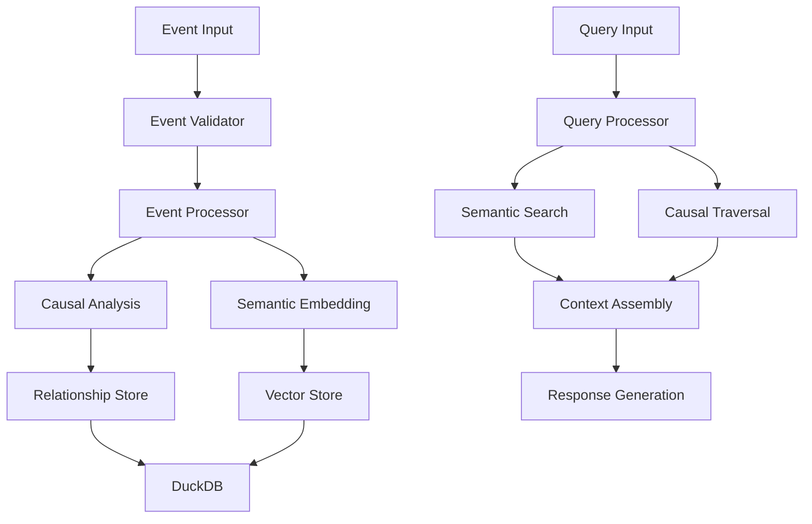

# 🏗️ Causal Memory Core Architecture

## 🎯 Overview

Causal Memory Core is designed as a modular, high-performance memory system that transforms sequential events into meaningful causal narratives. The architecture emphasizes scalability, reliability, and extensibility while maintaining semantic accuracy in causal relationship detection.

## 🧩 Core Components

### 1. Memory Core Engine (`memory_core.py`)

The central orchestrator that coordinates all memory operations.

```python
class CausalMemoryCore:
    """Main interface for the causal memory system."""
    
    def __init__(self, config: MemoryConfig):
        self.causal_engine = CausalEngine(config)
        self.semantic_search = SemanticSearch(config)
        self.database = DatabaseManager(config)
        self.event_processor = EventProcessor(config)
```

**Responsibilities:**
- Event lifecycle management
- Component coordination
- API interface provision
- Configuration management

### 2. Causal Engine (`causal_engine.py`)

Analyzes relationships between events using advanced NLP techniques.

```python
class CausalEngine:
    """Detects and analyzes causal relationships between events."""
    
    def analyze_causality(
        self, 
        new_event: Event, 
        existing_events: List[Event]
    ) -> List[CausalRelationship]:
        """Identify causal links between events."""
```

**Key Features:**
- GPT-powered causal analysis
- Temporal relationship detection
- Confidence scoring
- Relationship type classification

### 3. Semantic Search (`semantic_search.py`)

Provides intelligent context retrieval using vector embeddings.

```python
class SemanticSearch:
    """Semantic search and context retrieval system."""
    
    def search(
        self, 
        query: str, 
        filters: Optional[SearchFilters] = None
    ) -> List[SearchResult]:
        """Perform semantic search across stored events."""
```

**Capabilities:**
- Vector similarity search
- Context window optimization
- Multi-modal query support
- Result ranking and filtering

### 4. Database Manager (`utils/database.py`)

Handles all persistence operations using DuckDB.

```python
class DatabaseManager:
    """High-performance database operations."""
    
    def store_event(self, event: Event) -> EventID:
        """Store event with optimized indexing."""
    
    def query_events(self, criteria: QueryCriteria) -> List[Event]:
        """Efficient event retrieval with filtering."""
```

**Features:**
- ACID compliance
- Optimized indexing
- Batch operations
- Migration support

## 🔄 Data Flow Architecture



### Event Storage Pipeline

1. **Input Validation**
   - Schema validation
   - Content sanitization
   - Metadata extraction

2. **Event Processing**
   - Timestamp normalization
   - Content analysis
   - Metadata enrichment

3. **Causal Analysis**
   - Historical event comparison
   - Relationship detection
   - Confidence scoring

4. **Storage Operations**
   - Event persistence
   - Relationship mapping
   - Index updates

### Query Processing Pipeline

1. **Query Analysis**
   - Intent detection
   - Parameter extraction
   - Context requirements

2. **Search Execution**
   - Semantic matching
   - Causal traversal
   - Result ranking

3. **Context Assembly**
   - Narrative construction
   - Relationship inclusion
   - Response formatting

## 🗄️ Data Models

### Event Schema

```python
@dataclass
class Event:
    """Core event data structure."""
    id: EventID
    description: str
    timestamp: datetime
    metadata: Dict[str, Any]
    embedding: Optional[np.ndarray]
    causal_links: List[CausalRelationship]
```

### Causal Relationship Schema

```python
@dataclass
class CausalRelationship:
    """Represents a causal link between events."""
    source_event_id: EventID
    target_event_id: EventID
    relationship_type: CausalType
    confidence: float
    temporal_gap: timedelta
    reasoning: str
```

### Query Response Schema

```python
@dataclass
class QueryResponse:
    """Structured query response."""
    root_events: List[Event]
    causal_chain: List[CausalRelationship]
    narrative: str
    confidence: float
    metadata: ResponseMetadata
```

## 🚀 Performance Optimizations

### Database Optimizations

1. **Indexing Strategy**
   ```sql
   -- Temporal queries
   CREATE INDEX idx_events_timestamp ON events(timestamp);
   
   -- Semantic search
   CREATE INDEX idx_events_embedding ON events USING hnsw(embedding);
   
   -- Causal relationships
   CREATE INDEX idx_causal_source ON causal_relationships(source_event_id);
   ```

2. **Query Optimization**
   - Prepared statements for common queries
   - Connection pooling
   - Batch operations for bulk inserts

### Memory Management

1. **Embedding Cache**
   ```python
   class EmbeddingCache:
       """LRU cache for frequently accessed embeddings."""
       def __init__(self, max_size: int = 10000):
           self.cache = LRUCache(max_size)
   ```

2. **Query Result Caching**
   - Time-based cache expiration
   - Intelligent cache invalidation
   - Memory-conscious cache sizing

### Async Processing

```python
class AsyncEventProcessor:
    """Asynchronous event processing for high throughput."""
    
    async def process_batch(self, events: List[Event]) -> List[EventID]:
        """Process multiple events concurrently."""
        tasks = [self.process_single_event(event) for event in events]
        return await asyncio.gather(*tasks)
```

## 🔌 Integration Architecture

### MCP Server Integration

```python
class MCPServer:
    """Model Context Protocol server implementation."""
    
    def __init__(self, memory_core: CausalMemoryCore):
        self.memory = memory_core
        self.setup_handlers()
    
    def setup_handlers(self):
        """Register MCP protocol handlers."""
        self.register_tool("add_event", self.handle_add_event)
        self.register_tool("query", self.handle_query)
```

### External Tool Integration

The system supports various external integrations:

- **Desktop Commander**: File system operations
- **Web Search**: Information gathering
- **GitHub MCP**: Repository access
- **Custom Tools**: Extensible plugin system

## 🛡️ Security Architecture

### Data Protection

1. **Input Sanitization**
   ```python
   class EventValidator:
       """Validates and sanitizes event inputs."""
       
       def validate_event(self, event_data: Dict[str, Any]) -> Event:
           """Comprehensive input validation."""
           # SQL injection prevention
           # XSS protection
           # Data type validation
   ```

2. **Access Control**
   - API key authentication
   - Rate limiting
   - Request validation

### Privacy Considerations

- **Data Encryption**: All sensitive data encrypted at rest
- **Anonymization**: PII detection and removal options
- **Audit Logging**: Comprehensive operation logging

## 📊 Scalability Considerations

### Horizontal Scaling

1. **Database Sharding**
   - Time-based partitioning
   - Hash-based distribution
   - Cross-shard query optimization

2. **Service Decomposition**
   - Microservice architecture
   - Event-driven communication
   - Load balancing strategies

### Vertical Scaling

1. **Resource Optimization**
   - Memory usage profiling
   - CPU optimization
   - I/O optimization

2. **Caching Strategies**
   - Multi-level caching
   - Distributed caching
   - Cache coherence

## 🔧 Configuration Management

### Environment-Based Configuration

```python
class MemoryConfig:
    """Environment-aware configuration management."""
    
    def __init__(self, env: Environment = Environment.PRODUCTION):
        self.database_url = self.get_database_url(env)
        self.openai_settings = self.get_openai_settings(env)
        self.performance_settings = self.get_performance_settings(env)
```

### Feature Flags

```python
class FeatureFlags:
    """Dynamic feature enablement."""
    
    CAUSAL_ANALYSIS_V2 = "causal_analysis_v2"
    ASYNC_PROCESSING = "async_processing"
    ADVANCED_SEARCH = "advanced_search"
```

## 🚨 Error Handling Strategy

### Exception Hierarchy

```python
class MemoryError(Exception):
    """Base exception for memory system errors."""

class ValidationError(MemoryError):
    """Input validation failures."""

class StorageError(MemoryError):
    """Database operation failures."""

class ProcessingError(MemoryError):
    """Event processing failures."""
```

### Recovery Mechanisms

1. **Graceful Degradation**
   - Fallback to basic search when semantic search fails
   - Offline mode for critical operations
   - Partial result delivery

2. **Retry Strategies**
   - Exponential backoff for transient failures
   - Circuit breaker pattern for external services
   - Dead letter queues for failed operations

## 📈 Monitoring and Observability

### Metrics Collection

```python
class MetricsCollector:
    """System performance and usage metrics."""
    
    def record_event_processing_time(self, duration: float):
        """Track event processing performance."""
    
    def record_query_latency(self, latency: float):
        """Monitor query response times."""
```

### Health Checks

```python
class HealthChecker:
    """System health monitoring."""
    
    def check_database_health(self) -> HealthStatus:
        """Verify database connectivity and performance."""
    
    def check_openai_health(self) -> HealthStatus:
        """Validate OpenAI API connectivity."""
```

## 🔮 Future Architecture Considerations

### Planned Enhancements

1. **Multi-Modal Support**
   - Image and video event support
   - Audio event processing
   - Document integration

2. **Advanced AI Integration**
   - Custom model fine-tuning
   - Federated learning support
   - Real-time adaptation

3. **Enterprise Features**
   - Multi-tenant architecture
   - Advanced analytics
   - Compliance frameworks

### Technology Evolution

- **Database Migration**: Consideration for specialized vector databases
- **AI Model Updates**: Integration with newer language models
- **Protocol Support**: Additional integration protocols beyond MCP

---

This architecture provides a solid foundation for the Causal Memory Core system while maintaining flexibility for future enhancements and scaling requirements.