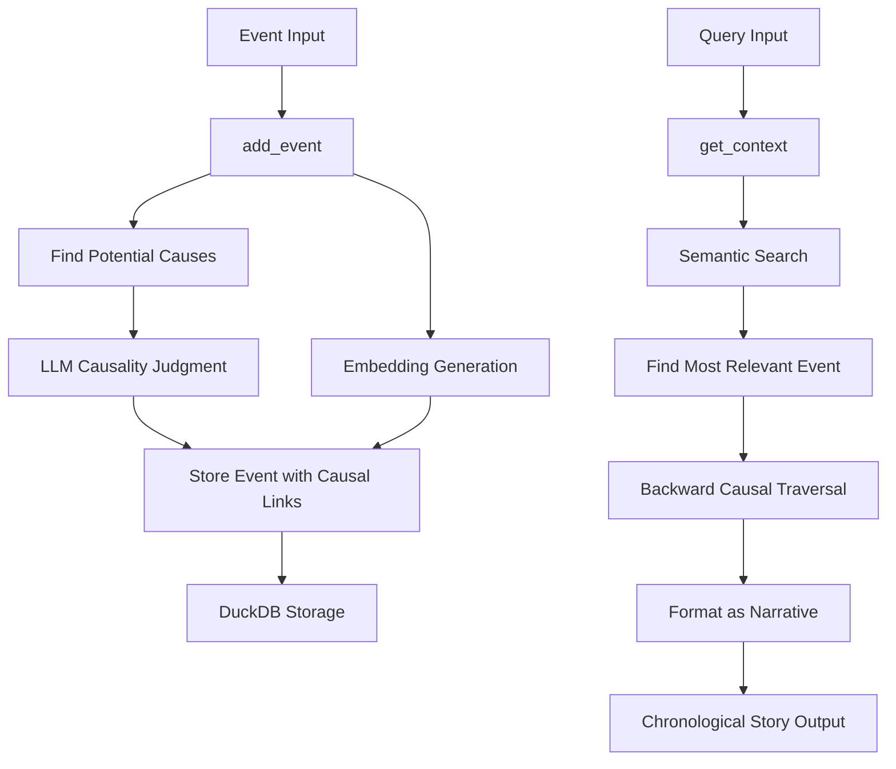

# 🏗️ Causal Memory Core Architecture v1.1.0

## 🎯 Overview

Causal Memory Core is designed as a modular, high-performance memory system that transforms sequential events into meaningful causal narratives. The architecture emphasizes scalability, reliability, and extensibility while maintaining semantic accuracy in causal relationship detection.

## 🧩 Core Components

### 1. Memory Core Engine (`src/causal_memory_core.py`)

The central orchestrator that coordinates all memory operations.

```python
class CausalMemoryCore:
    """Main interface for the causal memory system."""
    
    def __init__(self, db_path=None, llm_client=None, embedding_model=None):
        self.db_path = db_path or Config.DB_PATH
        self.llm_client = llm_client or OpenAI(api_key=Config.OPENAI_API_KEY)
        self.embedding_model = embedding_model or SentenceTransformer(Config.EMBEDDING_MODEL)
        self.conn = None
```

**Responsibilities:**

- Causal relationship detection
- Semantic search and context retrieval
- Database operations

### 2. MCP Server (`src/mcp_server.py`)

Model Context Protocol server for AI agent integration.

```python
@server.call_tool()
async def handle_call_tool(name: str, arguments: dict | None) -> list[types.TextContent]:
    """Handle tool calls for add_event and query operations."""
```

**Key Features:**

- Async tool handling
- Enhanced tool descriptions for v1.1.0
- Error handling and validation
- AI agent integration

### 3. CLI Interface (`cli.py`)

Command-line interface for direct system interaction.

```python
def main(argv=None):
    """Main CLI entry point with enhanced help system."""
```

**Capabilities:**

- Interactive and batch modes
- Enhanced help without initialization overhead
- Error handling for missing dependencies
- Resource optimization

## 🔄 Data Flow Architecture



### Event Storage Pipeline (v1.1.0)

1. **Event Input**: `add_event(effect_text)`
2. **Embedding Generation**: Convert text to vector using sentence-transformers
3. **Potential Cause Detection**: Find semantically similar recent events
4. **Causal Analysis**: LLM judges causal relationships
5. **Storage**: Store event with causal links in DuckDB

### Query Processing Pipeline (v1.1.0)

1. **Query Analysis**: `get_context(query)`
2. **Semantic Search**: Find most relevant event via vector similarity
3. **Causal Traversal**: Follow cause_id links backward to root
4. **Narrative Assembly**: Format as chronological story

## 🗄️ Data Models

### Event Schema (DuckDB)

```sql
CREATE TABLE events (
    event_id INTEGER PRIMARY KEY,
    timestamp TIMESTAMP DEFAULT CURRENT_TIMESTAMP,
    effect_text TEXT NOT NULL,
    embedding DOUBLE[384],
    cause_id INTEGER,
    causal_relationship TEXT
);
```

### Event Class

```python
@dataclass
class Event:
    """Core event data structure."""
    event_id: int
    timestamp: datetime
    effect_text: str
    embedding: np.ndarray
    cause_id: Optional[int] = None
    causal_relationship: Optional[str] = None
```

## 🚀 Performance Optimizations (v1.1.0)

### Database Optimizations

1. **Efficient Vector Operations**
   - Manual cosine similarity calculations
   - Optimized event filtering by timestamp
   - Prepared statements for common queries

2. **Memory Management**
   - Temporary database cleanup
   - Connection management
   - Resource cleanup patterns

### Similarity Search

```python
def _cosine_similarity(self, a, b):
    """Optimized cosine similarity calculation."""
    return np.dot(a, b) / (np.linalg.norm(a) * np.linalg.norm(b))
```

### Configuration

```python
class Config:
    """Centralized configuration management."""
    # Performance settings
    MAX_POTENTIAL_CAUSES = 5
    SIMILARITY_THRESHOLD = 0.5
    TIME_DECAY_HOURS = 24
    
    # MCP Server settings (v1.1.0)
    MCP_SERVER_VERSION = "1.1.0"
```

## 🔌 Integration Architecture (v1.1.0)

### MCP Protocol Integration

```python
# Enhanced tool descriptions for AI agents
types.Tool(
    name="query",
    description="Queries the memory and returns a full, narrative chain of causally-linked events related to the query."
)

types.Tool(
    name="add_event", 
    description="Add a new event to the causal memory system. The system will automatically determine causal relationships with previous events using semantic similarity and LLM reasoning."
)
```

### Docker Support (v1.1.0)

```dockerfile
FROM python:3.12-slim
WORKDIR /app
COPY requirements.txt .
RUN pip install --no-cache-dir -r requirements.txt
COPY . .
CMD ["python", "src/mcp_server.py"]
```

## 🛡️ Security Architecture

### Input Validation

```python
def add_event(self, effect_text):
    """Add event with input validation."""
    if not effect_text or not effect_text.strip():
        raise ValueError("Effect text cannot be empty")
```

### Error Handling

```python
try:
    response = self.llm_client.chat.completions.create(...)
except Exception as e:
    logger.warning(f"LLM causality judgment failed: {e}")
    return None  # Graceful degradation
```

## 📊 Narrative Output Format (v1.1.0)

The system produces chronological narratives:

```python
def _format_chain_as_narrative(self, chain):
    """Format causal chain as narrative story."""
    if len(ordered) == 1:
        return f"Initially, {ordered[0].effect_text}."
    
    narrative = f"Initially, {ordered[0].effect_text}."
    for i in range(1, len(ordered)):
        narrative += f" This led to {ordered[i].effect_text}"
        if ordered[i].causal_relationship:
            narrative += f", {ordered[i].causal_relationship}"
        narrative += "."
    
    return narrative
```

**Example Output:**

```text
"Initially, a bug report was filed for 'User login fails with 500 error'. 
This led to the production server logs being inspected, revealing a NullPointerException, 
which in turn caused the UserAuthentication service code to be reviewed, identifying a missing null check. 
This led to a patch being written to add the necessary null check, 
which in turn caused the patch to be successfully deployed to production, and the bug was marked as resolved."
```

## 🔧 Configuration Management (v1.1.0)

### Environment-Based Configuration

```python
class Config:
    """Environment-aware configuration with defaults."""
    
    # Database settings
    DB_PATH = os.getenv('DB_PATH', 'causal_memory.db')
    
    # LLM settings
    OPENAI_API_KEY = os.getenv('OPENAI_API_KEY')
    LLM_MODEL = os.getenv('LLM_MODEL', 'gpt-3.5-turbo')
    
    # Search settings
    SIMILARITY_THRESHOLD = float(os.getenv('SIMILARITY_THRESHOLD', '0.5'))
    MAX_POTENTIAL_CAUSES = int(os.getenv('MAX_POTENTIAL_CAUSES', '5'))
```

## 🐳 Docker Architecture (v1.1.0)

### Production Deployment

```yaml
# docker-compose.yml
version: '3.8'
services:
  causal-memory-core:
    build: .
    image: causal-memory-core:1.1.0
    environment:
      - OPENAI_API_KEY=${OPENAI_API_KEY}
      - DB_PATH=/app/data/causal_memory.db
    volumes:
      - causal_memory_data:/app/data
```

## 📈 Testing Architecture

### Test Structure

- **Unit Tests**: `tests/test_memory_core.py`
- **E2E Tests**: `tests/e2e/`
- **MCP Server Tests**: `tests/e2e/test_mcp_server_e2e.py`

### Current Test Results (v1.1.0)

- **98% Pass Rate**: 127/129 tests passing
- **Comprehensive Coverage**: Unit, integration, and E2E tests
- **Performance Validation**: Multi-event chain retrieval under 500ms

---

This architecture provides a solid foundation for the Causal Memory Core v1.1.0 system with production-ready Docker support, enhanced MCP integration, and comprehensive narrative capabilities.
